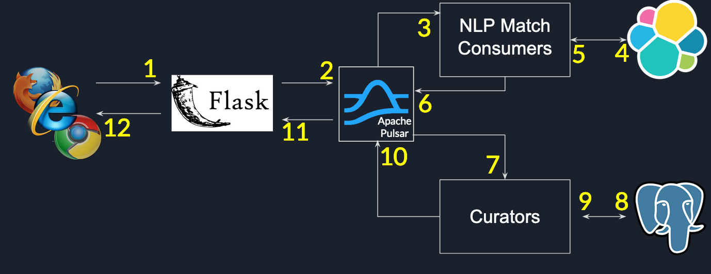

***************
you-complete-me
***************

Introduction
############

*you-complete-me* is a real time data pipeline for providing suggestions based on
semantic information to users posting questions in social media platforms.

Demo_ and Slides_.

.. _Demo: https://www.youtube.com/watch?v=at1oKQ8z4aU
.. _Slides: https://docs.google.com/presentation/d/1Mul35kcTs_uO0nq-HNzs_09jkEVuctAkxtE7EwbCvIg

Problem Statement
#################

Social media platforms like Quora, Nextdoor and StackExchange primarily attract users
looking for high quality answers to their questions. Hence, these platforms are focused
on maintaining and improving the quality of content hosted in their systems.

So, what is *content*? In this context, content usually takes the form of questions,
answers, status updates or comments posted by an user. This project is motivated by
the hypothesis that content quality can be improved just before a *thought in a
user's mind* becomes a post. Surfacing high quality real-time suggestions during message
composition allows users to ask richer questions which in turn helps other provide
relevant answers.

So, the problem statement is as follows: How do we build a real time data pipeline that
can provide suggestions based on content to users posting questions in social media platforms?

Existing Solutions
##################
Several platforms like Google, Stack Overflow provide auto complete based suggestions.
However, such suggestions are primarily generated by using prefix based string compare
(using trie or similar data structure). Instead, this project compares semantic information
in the text with similar questions that have been already posted. By inferring the meaning
behind the question, we can provide much relevant suggestions than conventional solutions.

Technology stack
################

The project is composed of two parts, a batch and a real time pipeline.

The batch pipeline serves as the Extract-Transform-Load (ETL) pipeline.
The raw data_ is stored in Amazon S3 as a collection of files in the NDJSON_
format. Using Apache Spark, we extract questions from these input files
and index them in AWS Elastic Search. We also extract question metadata
(like creation date, the number of answers and the stackexchange subdomain)
using Spark and save them in a PostgreSQL database.

.. _data: https://files.pushshift.io/stackexchange

.. _NDJSON: http://ndjson.org/

The real time pipeline is architected using Apache Pulsar_ as the backbone. User
queries received by the web-server (1) are published to Pulsar message brokers (2).
Consumers listening to the *get-suggestions* topic receive these messages from the
broker (3) and query elastic search (4, 5). Query responses are published
to the *curate* topic (6) where a group of curators rank the response based on a simple
heuristic using metadata available in PostgreSQL (7, 8 and 9). The ranked suggestions
are sent back to the user by the web-server listening to messages published
in the *suggestions-list* topic (10, 11, and 12).

.. _Pulsar: https://pulsar.apache.org/

Data source
###########

A subset of the stackexchange_ dataset.

.. _stackexchange: https://files.pushshift.io/stackexchange
